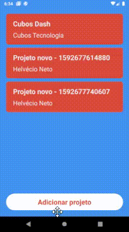
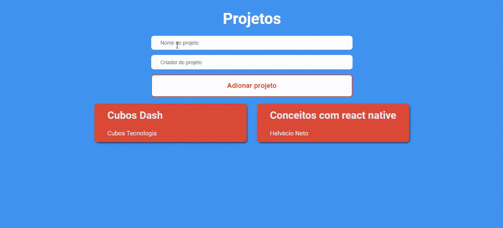

<div align="center">
  

  ## Conceitos de NodeJS, React, e React Native
</div>


<div align="center">
  
  
</div>

## 🔖 Sobre

Aplicação para gerenciamento de projetos criado durante o GoStack para fixar os conceitos de NodeJS, React e React Native.

## 💻 Tecnologias utilizadas

### Backend
- cors
- express
- uuidv4

## Frontend
- axios
- babel
- react
- webpack

## Mobile
- axios
- react-native

## 📂 Como baixar o projeto

```bash
  # Clonar repositório
  $ https://github.com/netohelvecio/conceitos-dev-gostack

  # Entrar na pasta do repositório
  $ cd conceitos-dev-gostack

  # Backend

  # Entrar na pasta do backend
  $ cd backend

  # Instalar dependências
  $ yarn

  # Inicar app
  $ yarn dev

  # Frontend

  # Entrar na pasta do frontend
  $ cd frontend

  # Instalar dependências
  $ yarn

  # Inicar app
  $ yarn start

  # Mobile

  # Entrar na pasta do mobile
  $ cd mobile

  # Instalar dependências
  $ yarn

  # Instalar app no emulador
  $ npx react-native run-android

  # Iniciar app
  $ yarn start
```

---

Desenvolvido por Helvécio Neto
